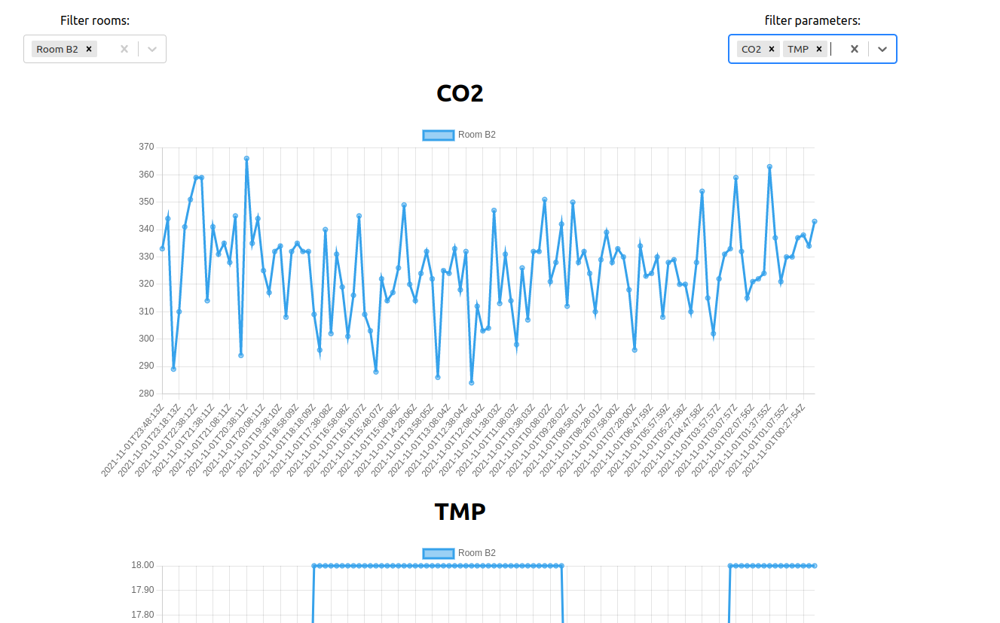

# Pando2-Test

Technical test for Pando2.

Project extract data from csv files in ./backend/lib/csvs to postgresql db.

In frontend app you can visualize and filter data as follow:

## Run the app with docker

git clone the projet

`docker compose build`

`docker compose up`

open frontend app in your browser on localhost:3001

## Setup the app on you machine

git clone the projet

in ./backend

`bundle install`

`rails db:create`

`rails db:migrate`

`rake extract:measurements`

`rails s`

in ./frontend

`yarn install`

`yarn start`

open frontend app in your browser on localhost:3001

